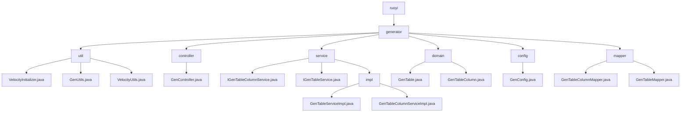

# 基础信息

|      |      |
|------|------|
| 编码语言 | .java |
| 代码路径 | ruoyi-generator/ruoyi-generator/src/main/java/com/ruoyi |
| 包名 | ruoyi-generator.ruoyi-generator.src.main.java.com.ruoyi |
| 概述说明 | VelocityInitializer初始化Velocity引擎，GenUtils处理表列属性，VelocityUtils生成模板上下文，GenController处理代码生成和权限控制，GenTableServiceImpl支持业务操作和代码生成，GenTable和GenTableColumn管理表结构，GenConfig配置生成器属性。 |

# 说明

VelocityInitializer类负责初始化Velocity引擎，配置资源加载器和字符集，确保引擎启动时具备正确的资源加载方式和字符集设置，为模板处理和渲染提供基础支持。GenUtils类用于初始化表和列的属性，将表名转换为特定格式，设置包名，处理字段类型，自动化和标准化表和列的定义，提高开发效率和代码一致性。VelocityUtils类是一个生成模板上下文的工具类，处理路径、菜单和树结构等配置，方便用户获取和管理模板所需的上下文信息，确保模板正确渲染，简化上下文生成过程，提升开发效率和代码可维护性。GenController负责处理代码生成、表结构导入、修改和删除等操作，同时涉及权限控制和数据查询功能。GenTableServiceImpl实现了IGenTableService接口，提供了全面的业务功能支持，包括业务数据的查询、修改和删除操作，并具备生成代码的能力，显著提升了开发效率和系统可维护性。GenTable类用于生成和管理表结构，包含表名、描述、列信息和生成路径等关键属性，支持处理子表、树表及常见的CRUD操作，适用于复杂表结构的生成。GenTableColumn类负责管理表列信息，包含列ID、表ID、列名、数据类型和对应的Java字段等属性，支持检查主键状态、自增属性和必填状态，确保表列信息的完整性和准确性。GenConfig类配置生成器属性主要包括作者、包路径、表前缀、自动去除前缀及文件覆盖权限，这些属性共同确保了配置生成器的灵活性和可定制性。

### 包内部结构视图

该流程图展示了ruoyi-generator项目的文件结构，从根目录ruoyi开始，逐步展开到各个子目录和文件。generator目录下包含util、controller、service、domain、config和mapper等子目录，每个子目录中又包含具体的Java文件。这种结构清晰地反映了项目的模块化设计，便于管理和维护。

# 文件列表 File List

| 名称   | 类型  | 说明 |
|-------|------|-------------|
| [generator](generator/_module.md) | package | VelocityInitializer初始化Velocity引擎，GenUtils处理表列属性，VelocityUtils生成模板上下文，GenController处理代码生成和权限控制，GenTableServiceImpl支持业务操作和代码生成，GenTable和GenTableColumn管理表结构，GenConfig配置生成器属性。 |
| [generator](generator/_module.md) | package | VelocityInitializer初始化Velocity引擎，GenUtils处理表列属性，VelocityUtils生成模板上下文，GenController处理代码生成和权限控制，GenTableServiceImpl支持业务操作和代码生成，GenTable和GenTableColumn管理表结构，GenConfig配置生成器属性。 |

