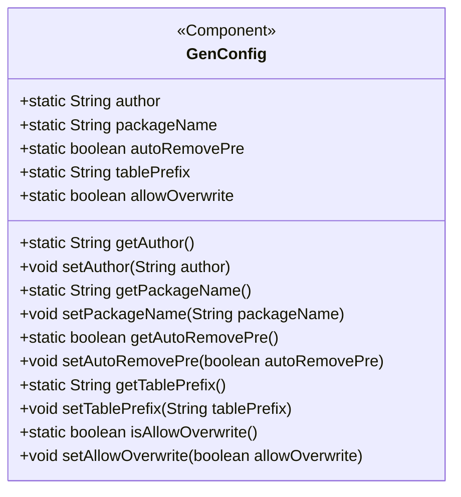

# 基础信息

|      |      |
|------|------|
| 编码语言 | .java |
| 代码路径 | ruoyi-generator/ruoyi-generator/src/main/java/com/ruoyi/generator/config/GenConfig.java |
| 包名 | com.ruoyi.generator.config |
| 依赖项 | ['org.springframework.beans.factory.annotation.Value', 'org.springframework.boot.context.properties.ConfigurationProperties', 'org.springframework.context.annotation.PropertySource', 'org.springframework.stereotype.Component'] |
| 概述说明 | GenConfig类配置生成器属性含作者、包路径、表前缀、自动去前缀及文件覆盖权限。 |

# 说明

GenConfig类配置生成器属性主要包括作者、包路径、表前缀、自动去除前缀及文件覆盖权限。作者属性用于标识生成器的创建者；包路径指定生成文件的目标位置；表前缀用于在生成过程中添加或识别表名前缀；自动去除前缀功能可自动移除表名前缀；文件覆盖权限决定是否允许覆盖已存在的文件。这些属性共同确保了配置生成器的灵活性和可定制性。

# 类列表 Class Summary

| 名称   | 类型  | 说明 |
|-------|------|-------------|
| GenConfig | class | GenConfig类配置生成器属性，包括作者、包路径、表前缀、自动去除前缀及文件覆盖权限。 |

## 类 GenConfig

|      |      |
|------|------|
| 访问范围 | @Component;@ConfigurationProperties(prefix = "gen");@PropertySource(value = { "classpath:generator.yml" });public |
| 类型 | class |
| 名称 | GenConfig |
| 说明 | GenConfig类配置生成器属性，包括作者、包路径、表前缀、自动去除前缀及文件覆盖权限。 |

### UML类图

**描述：**  
`GenConfig` 类是一个配置类，用于管理代码生成器的相关配置。它使用了 `@Component` 注解标记为 Spring 组件，并通过 `@ConfigurationProperties` 和 `@PropertySource` 注解从 `generator.yml` 文件中加载配置。类中定义了多个静态字段，如作者、包路径、表前缀等，并提供了相应的 getter 和 setter 方法。这些方法通过 `@Value` 注解将配置文件中的值注入到静态字段中，方便在代码生成过程中使用。

### 内部方法调用关系图

```mermaid
graph TD
    A["类GenConfig"]
    B["属性: String author"]
    C["属性: String packageName"]
    D["属性: boolean autoRemovePre"]
    E["属性: String tablePrefix"]
    F["属性: boolean allowOverwrite"]
    G["方法: String getAuthor()"]
    H["方法: void setAuthor(String author)"]
    I["方法: String getPackageName()"]
    J["方法: void setPackageName(String packageName)"]
    K["方法: boolean getAutoRemovePre()"]
    L["方法: void setAutoRemovePre(boolean autoRemovePre)"]
    M["方法: String getTablePrefix()"]
    N["方法: void setTablePrefix(String tablePrefix)"]
    O["方法: boolean isAllowOverwrite()"]
    P["方法: void setAllowOverwrite(boolean allowOverwrite)"]

    A --> B
    A --> C
    A --> D
    A --> E
    A --> F
    A --> G
    A --> H
    A --> I
    A --> J
    A --> K
    A --> L
    A --> M
    A --> N
    A --> O
    A --> P
```

这段代码定义了一个名为 `GenConfig` 的类，该类用于配置生成代码的相关属性。类中包含五个静态属性：`author`、`packageName`、`autoRemovePre`、`tablePrefix` 和 `allowOverwrite`，分别用于存储作者、生成包路径、是否自动去除表前缀、表前缀以及是否允许文件覆盖到本地。每个属性都有对应的 `getter` 和 `setter` 方法，`setter` 方法通过 `@Value` 注解从配置文件中注入值。

### 字段列表 Field List

| 名称  | 类型  | 说明 |
|-------|-------|------|
| author | String | 声明一个公共静态字符串变量author。 |
| tablePrefix | String | 静态字符串变量用于存储表前缀。 |
| autoRemovePre | boolean | 自动移除前缀的静态布尔变量。 |
| packageName | String | 静态字符串变量packageName声明为公开访问。 |
| allowOverwrite | boolean | 静态布尔变量控制是否允许覆盖操作。 |

### 方法列表 Method List

| 名称  | 类型  | 说明 |
|-------|-------|------|
| getAuthor | String | 静态方法返回作者信息。 |
| getTablePrefix | String | 获取表前缀的静态方法。 |
| isAllowOverwrite | boolean | 方法返回布尔值，表示是否允许覆盖。 |
| getAutoRemovePre | boolean | 静态方法getAutoRemovePre返回布尔值autoRemovePre。 |
| setAuthor | void | 设置作者属性并赋值给GenConfig的静态变量。 |
| getPackageName | String | 获取包名的静态方法。 |
| setAllowOverwrite | void | 设置GenConfig.allowOverwrite属性的方法。 |
| setAutoRemovePre | void | 设置自动移除前缀方法，更新GenConfig配置。 |
| setPackageName | void | 通过注解设置包名并更新配置类中的包名变量。 |
| setTablePrefix | void | 设置表前缀的公共方法，将传入值赋给GenConfig的tablePrefix。 |

