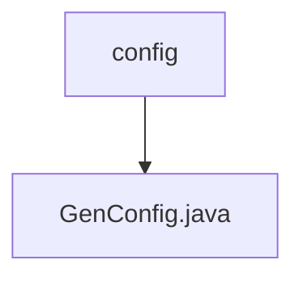

# 基础信息

|      |      |
|------|------|
| 编码语言 | .java |
| 代码路径 | ruoyi-generator/ruoyi-generator/src/main/java/com/ruoyi/generator/config |
| 包名 | ruoyi-generator.ruoyi-generator.src.main.java.com.ruoyi.generator.config |
| 概述说明 | GenConfig类配置生成器属性含作者、包路径、表前缀、自动去前缀及文件覆盖权限。 |

# 说明

GenConfig类配置生成器属性主要包括作者、包路径、表前缀、自动去除前缀及文件覆盖权限。作者属性用于标识生成器的创建者；包路径指定生成文件的目标位置；表前缀用于在生成过程中添加或识别表名前缀；自动去除前缀功能可自动移除表名前缀；文件覆盖权限决定是否允许覆盖已存在的文件。这些属性共同确保了配置生成器的灵活性和可定制性。

### 包内部结构视图

该流程图展示了路径层级关系，`config`文件夹下包含`GenConfig.java`文件。这种层级关系清晰地反映了文件在项目中的组织结构，便于开发人员快速定位和管理相关配置文件。

# 文件列表 File List

| 名称   | 类型  | 说明 |
|-------|------|-------------|
| [GenConfig.java](GenConfig.md) | file | GenConfig类配置生成器属性含作者、包路径、表前缀、自动去前缀及文件覆盖权限。 |
| [GenConfig.java](GenConfig.md) | file | GenConfig类配置生成器属性含作者、包路径、表前缀、自动去前缀及文件覆盖权限。 |

