# 基础信息

|      |      |
|------|------|
| 编码语言 | .java |
| 代码路径 | ruoyi-generator/ruoyi-generator/src/main/java/com/ruoyi/generator/controller/GenController.java |
| 包名 | com.ruoyi.generator.controller |
| 依赖项 | ['java.io.IOException', 'java.util.ArrayList', 'java.util.List', 'java.util.Map', 'javax.servlet.http.HttpServletResponse', 'org.apache.commons.io.IOUtils', 'org.apache.shiro.authz.annotation.RequiresPermissions', 'org.apache.shiro.authz.annotation.RequiresRoles', 'org.springframework.beans.factory.annotation.Autowired', 'org.springframework.stereotype.Controller', 'org.springframework.ui.ModelMap', 'org.springframework.validation.annotation.Validated', 'org.springframework.web.bind.annotation.GetMapping', 'org.springframework.web.bind.annotation.PathVariable', 'org.springframework.web.bind.annotation.PostMapping', 'org.springframework.web.bind.annotation.RequestMapping', 'org.springframework.web.bind.annotation.ResponseBody', 'com.alibaba.druid.DbType', 'com.alibaba.druid.sql.SQLUtils', 'com.alibaba.druid.sql.ast.SQLStatement', 'com.alibaba.druid.sql.dialect.mysql.ast.statement.MySqlCreateTableStatement', 'com.alibaba.fastjson.JSON', 'com.ruoyi.common.annotation.Log', 'com.ruoyi.common.core.controller.BaseController', 'com.ruoyi.common.core.domain.AjaxResult', 'com.ruoyi.common.core.domain.CxSelect', 'com.ruoyi.common.core.page.TableDataInfo', 'com.ruoyi.common.core.text.Convert', 'com.ruoyi.common.enums.BusinessType', 'com.ruoyi.common.utils.StringUtils', 'com.ruoyi.common.utils.security.PermissionUtils', 'com.ruoyi.common.utils.sql.SqlUtil', 'com.ruoyi.generator.config.GenConfig', 'com.ruoyi.generator.domain.GenTable', 'com.ruoyi.generator.domain.GenTableColumn', 'com.ruoyi.generator.service.IGenTableColumnService', 'com.ruoyi.generator.service.IGenTableService'] |
| 概述说明 | GenController负责代码生成、表结构操作及权限控制与数据查询。 |

# 说明

GenController负责处理代码生成、表结构导入、修改和删除等操作，同时涉及权限控制和数据查询功能。该控制器在代码生成过程中能够根据需求自动生成相关代码，支持表结构的导入和修改，并允许删除操作。权限控制确保只有授权用户能够执行这些操作，而数据查询功能则用于获取和处理相关数据信息。

# 类列表 Class Summary

| 名称   | 类型  | 说明 |
|-------|------|-------------|
| GenController | class | GenController处理代码生成、表结构导入、修改和删除等操作，涉及权限控制和数据查询。 |

## 类 GenController

|      |      |
|------|------|
| 访问范围 | @Controller;@RequestMapping("/tool/gen");public |
| 类型 | class |
| 名称 | GenController |
| 说明 | GenController处理代码生成、表结构导入、修改和删除等操作，涉及权限控制和数据查询。 |

### UML类图

```mermaid
classDiagram
    class GenController {
        -String prefix
        +GenController()
        +String gen()
        +TableDataInfo genList(GenTable genTable)
        +TableDataInfo dataList(GenTable genTable)
        +TableDataInfo columnList(GenTableColumn genTableColumn)
        +String importTable()
        +String createTable()
        +AjaxResult importTableSave(String tables)
        +String edit(Long tableId, ModelMap mmap)
        +AjaxResult editSave(GenTable genTable)
        +AjaxResult remove(String ids)
        +AjaxResult create(String sql)
        +AjaxResult preview(Long tableId)
        +void download(HttpServletResponse response, String tableName)
        +AjaxResult genCode(String tableName)
        +AjaxResult synchDb(String tableName)
        +void batchGenCode(HttpServletResponse response, String tables)
        -void genCode(HttpServletResponse response, byte[] data)
    }

    class BaseController {
        <<Interface>>
        +void startPage()
        +TableDataInfo getDataTable(List~T~ list)
    }

    class IGenTableService {
        <<Interface>>
        +List~GenTable~ selectGenTableList(GenTable genTable)
        +List~GenTable~ selectDbTableList(GenTable genTable)
        +List~GenTable~ selectDbTableListByNames(String[] tableNames)
        +GenTable selectGenTableById(Long tableId)
        +List~GenTable~ selectGenTableAll()
        +void importGenTable(List~GenTable~ tableList, String operName)
        +void validateEdit(GenTable genTable)
        +void updateGenTable(GenTable genTable)
        +void deleteGenTableByIds(String ids)
        +boolean createTable(String sql)
        +Map~String, String~ previewCode(Long tableId)
        +byte[] downloadCode(String tableName)
        +void generatorCode(String tableName)
        +void synchDb(String tableName)
        +byte[] downloadCode(String[] tableNames)
    }

    class IGenTableColumnService {
        <<Interface>>
        +List~GenTableColumn~ selectGenTableColumnListByTableId(GenTableColumn genTableColumn)
    }

    class GenTable {
        -Long tableId
        -String tableName
        -String tableComment
        -List~GenTableColumn~ columns
    }

    class GenTableColumn {
        -String columnName
        -String columnComment
    }

    class TableDataInfo {
        -List~T~ rows
        -int total
        +void setRows(List~T~ rows)
        +void setTotal(int total)
    }

    class AjaxResult {
        -String message
        -boolean success
        +AjaxResult success()
        +AjaxResult error(String message)
    }

    class CxSelect {
        -String name
        -String value
        -List~CxSelect~ s
        +CxSelect(String name, String value)
        +void setS(List~CxSelect~ s)
    }

    class SQLStatement {
        <<Interface>>
    }

    class MySqlCreateTableStatement {
        -String tableName
        +String getTableName()
    }

    class SqlUtil {
        +void filterKeyword(String sql)
    }

    class SQLUtils {
        +List~SQLStatement~ parseStatements(String sql, DbType dbType)
    }

    class DbType {
        <<Enum>>
        mysql
    }

    class Convert {
        +String[] toStrArray(String str)
        +String toStr(Object obj)
    }

    class PermissionUtils {
        +Object getPrincipalProperty(String propertyName)
    }

    class GenConfig {
        +boolean isAllowOverwrite()
    }

    class IOUtils {
        +void write(byte[] data, OutputStream outputStream)
    }

    GenController --> BaseController : 继承
    GenController --> IGenTableService : 依赖
    GenController --> IGenTableColumnService : 依赖
    GenController --> TableDataInfo : 依赖
    GenController --> AjaxResult : 依赖
    GenController --> CxSelect : 依赖
    GenController --> SQLStatement : 依赖
    GenController --> SqlUtil : 依赖
    GenController --> SQLUtils : 依赖
    GenController --> Convert : 依赖
    GenController --> PermissionUtils : 依赖
    GenController --> GenConfig : 依赖
    GenController --> IOUtils : 依赖
    IGenTableService --> GenTable : 依赖
    IGenTableColumnService --> GenTableColumn : 依赖
    MySqlCreateTableStatement --> SQLStatement : 实现
```

这段代码是一个基于Spring MVC的控制器类 `GenController`，主要用于处理代码生成相关的请求。它继承自 `BaseController`，并依赖于 `IGenTableService` 和 `IGenTableColumnService` 两个服务接口来处理业务逻辑。控制器中的方法涵盖了代码生成、表结构导入、表字段查询、代码预览、代码下载等功能。通过 `TableDataInfo` 和 `AjaxResult` 类返回数据结果，并使用 `CxSelect` 类来处理前端选择框的数据结构。整个类图展示了控制器与各个服务、工具类之间的依赖关系，以及它们如何协同工作来完成代码生成的任务。

### 内部方法调用关系图

```mermaid
graph TD
    A["类GenController"]
    B["属性: String prefix"]
    C["属性: IGenTableService genTableService"]
    D["属性: IGenTableColumnService genTableColumnService"]
    E["方法: String gen()"]
    F["方法: TableDataInfo genList(GenTable genTable)"]
    G["方法: TableDataInfo dataList(GenTable genTable)"]
    H["方法: TableDataInfo columnList(GenTableColumn genTableColumn)"]
    I["方法: String importTable()"]
    J["方法: String createTable()"]
    K["方法: AjaxResult importTableSave(String tables)"]
    L["方法: String edit(Long tableId, ModelMap mmap)"]
    M["方法: AjaxResult editSave(GenTable genTable)"]
    N["方法: AjaxResult remove(String ids)"]
    O["方法: AjaxResult create(String sql)"]
    P["方法: AjaxResult preview(Long tableId)"]
    Q["方法: void download(HttpServletResponse response, String tableName)"]
    R["方法: AjaxResult genCode(String tableName)"]
    S["方法: AjaxResult synchDb(String tableName)"]
    T["方法: void batchGenCode(HttpServletResponse response, String tables)"]
    U["方法: void genCode(HttpServletResponse response, byte[] data)"]

    A --> B
    A --> C
    A --> D
    A --> E
    A --> F
    A --> G
    A --> H
    A --> I
    A --> J
    A --> K
    A --> L
    A --> M
    A --> N
    A --> O
    A --> P
    A --> Q
    A --> R
    A --> S
    A --> T
    A --> U
```

这段代码是一个Spring MVC控制器类`GenController`，用于处理与代码生成相关的请求。它继承自`BaseController`，并定义了多个方法来处理不同的HTTP请求，如查询代码生成列表、查询数据库列表、导入表结构、修改代码生成业务等。每个方法都通过注解与特定的URL路径和HTTP方法绑定，并调用相应的服务类方法来完成业务逻辑。代码中还包含权限控制和日志记录功能，确保操作的安全性和可追溯性。

### 字段列表 Field List

| 名称  | 类型  | 说明 |
|-------|-------|------|
| prefix = "tool/gen" | String | 私有字符串变量prefix初始化为"tool/gen"。 |
| genTableService | IGenTableService | 自动注入生成表服务实例。 |
| genTableColumnService | IGenTableColumnService | 自动注入GenTableColumnService服务实例。 |

### 方法列表 Method List

| 名称  | 类型  | 说明 |
|-------|-------|------|
| importTable | String | 需要权限的导入表格接口。 |
| createTable | String | GetMapping注解定义创建表格的请求路径。 |
| genList | TableDataInfo | 权限验证后，分页查询并返回GenTable列表数据。 |
| batchGenCode | void | 代码生成接口，需权限，批量下载生成代码。 |
| create | AjaxResult | 管理员通过SQL语句创建表，处理异常并记录日志。 |
| genCode | AjaxResult | 代码生成接口，需权限，检查配置后生成代码。 |
| dataList | TableDataInfo | 权限要求下，通过POST请求获取数据库表列表并返回分页数据。 |
| edit | String | 根据表ID编辑数据，生成选择列表并返回编辑页面。 |
| columnList | TableDataInfo | 通过权限验证后，查询并返回指定表的列信息。 |
| editSave | AjaxResult | 代码生成编辑接口，验证并更新生成表，返回成功结果。 |
| remove | AjaxResult | 需要权限"tool:gen:remove"，删除代码生成记录，返回成功结果。 |
| synchDb | AjaxResult | 权限校验后，同步数据库表数据并返回成功结果。 |
| download | void | 该代码实现通过指定表名下载生成的代码，需权限并记录日志。 |
| genCode | void | 生成代码方法：重置响应，设置文件名、长度和类型，写入数据流。 |
| gen | String | 权限验证后，通过GET请求返回指定路径的视图。 |
| preview | AjaxResult | 接口预览表格代码，需权限，返回Ajax结果。 |
| importTableSave | AjaxResult | 导入表信息并生成代码，需权限验证和日志记录。 |

