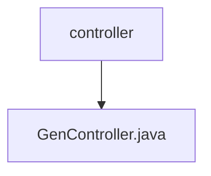

# 基础信息

|      |      |
|------|------|
| 编码语言 | .java |
| 代码路径 | ruoyi-generator/ruoyi-generator/src/main/java/com/ruoyi/generator/controller |
| 包名 | ruoyi-generator.ruoyi-generator.src.main.java.com.ruoyi.generator.controller |
| 概述说明 | GenController负责代码生成、表结构操作及权限控制与数据查询。 |

# 说明

GenController负责处理代码生成、表结构导入、修改和删除等操作，同时涉及权限控制和数据查询功能。该控制器在代码生成过程中能够根据需求自动生成相关代码，支持表结构的导入和修改，并允许删除操作。权限控制确保只有授权用户能够执行这些操作，而数据查询功能则用于获取和处理相关数据信息。

### 包内部结构视图

该流程图展示了`controller`文件夹与`GenController.java`文件之间的层级关系。`controller`是父节点，`GenController.java`是其子节点，表示该文件位于`controller`文件夹内。

# 文件列表 File List

| 名称   | 类型  | 说明 |
|-------|------|-------------|
| [GenController.java](GenController.md) | file | GenController负责代码生成、表结构操作及权限控制与数据查询。 |
| [GenController.java](GenController.md) | file | GenController负责代码生成、表结构操作及权限控制与数据查询。 |

