# 基础信息

|      |      |
|------|------|
| 编码语言 | .java |
| 代码路径 | ruoyi-generator/ruoyi-generator/src/main/java/com/ruoyi/generator/domain/GenTableColumn.java |
| 包名 | com.ruoyi.generator.domain |
| 依赖项 | ['javax.validation.constraints.NotBlank', 'com.ruoyi.common.core.domain.BaseEntity', 'com.ruoyi.common.utils.StringUtils'] |
| 概述说明 | GenTableColumn类管理表列信息，支持主键、自增、必填等状态检查。 |

# 说明

GenTableColumn类负责管理表列的相关信息，包含列ID、表ID、列名、数据类型、对应的Java字段等关键属性。该类支持对列的主键状态、自增属性以及是否必填等状态进行检查和设置，确保表列信息的完整性和准确性。

# 类列表 Class Summary

| 名称   | 类型  | 说明 |
|-------|------|-------------|
| GenTableColumn | class | GenTableColumn类用于管理表列信息，包含列ID、表ID、列名、类型、Java字段等属性，支持主键、自增、必填等状态检查。 |

## 类 GenTableColumn

|      |      |
|------|------|
| 访问范围 | public |
| 类型 | class |
| 名称 | GenTableColumn |
| 说明 | GenTableColumn类用于管理表列信息，包含列ID、表ID、列名、类型、Java字段等属性，支持主键、自增、必填等状态检查。 |

### UML类图

```mermaid
classDiagram
    class BaseEntity {
        <<Interface>>
    }

    class GenTableColumn {
        -Long columnId
        -Long tableId
        -String columnName
        -String columnComment
        -String columnType
        -String javaType
        -String javaField
        -String isPk
        -String isIncrement
        -String isRequired
        -String isInsert
        -String isEdit
        -String isList
        -String isQuery
        -String queryType
        -String htmlType
        -String dictType
        -Integer sort
        +void setColumnId(Long columnId)
        +Long getColumnId()
        +void setTableId(Long tableId)
        +Long getTableId()
        +void setColumnName(String columnName)
        +String getColumnName()
        +void setColumnComment(String columnComment)
        +String getColumnComment()
        +void setColumnType(String columnType)
        +String getColumnType()
        +void setJavaType(String javaType)
        +String getJavaType()
        +void setJavaField(String javaField)
        +String getJavaField()
        +String getCapJavaField()
        +void setIsPk(String isPk)
        +String getIsPk()
        +boolean isPk()
        +boolean isPk(String isPk)
        +void setIsIncrement(String isIncrement)
        +String getIsIncrement()
        +boolean isIncrement()
        +boolean isIncrement(String isIncrement)
        +void setIsRequired(String isRequired)
        +String getIsRequired()
        +boolean isRequired()
        +boolean isRequired(String isRequired)
        +void setIsInsert(String isInsert)
        +String getIsInsert()
        +boolean isInsert()
        +boolean isInsert(String isInsert)
        +void setIsEdit(String isEdit)
        +String getIsEdit()
        +boolean isEdit()
        +boolean isEdit(String isEdit)
        +void setIsList(String isList)
        +String getIsList()
        +boolean isList()
        +boolean isList(String isList)
        +void setIsQuery(String isQuery)
        +String getIsQuery()
        +boolean isQuery()
        +boolean isQuery(String isQuery)
        +void setQueryType(String queryType)
        +String getQueryType()
        +void setHtmlType(String htmlType)
        +String getHtmlType()
        +void setDictType(String dictType)
        +String getDictType()
        +void setSort(Integer sort)
        +Integer getSort()
        +boolean isSuperColumn()
        +static boolean isSuperColumn(String javaField)
        +boolean isUsableColumn()
        +static boolean isUsableColumn(String javaField)
        +String readConverterExp()
    }

    BaseEntity <|-- GenTableColumn : 继承
```

**描述：**  
`GenTableColumn` 类继承自 `BaseEntity`，主要用于描述数据库表中的列属性。它包含了列的基本信息如列ID、表ID、列名、列类型、Java类型等，以及一些标志位如是否为主键、是否自增、是否必填等。此外，该类还提供了一系列方法来设置和获取这些属性，并包含了一些辅助方法如判断列是否为超级列、是否可用列等。

### 内部方法调用关系图

这段代码定义了一个名为 `GenTableColumn` 的类，该类继承自 `BaseEntity`，包含多个属性以及对应的 `getter` 和 `setter` 方法。此外，类中还定义了一些用于判断字段类型、是否为主键、是否自增等业务逻辑的方法。流程图展示了类的属性与方法之间的调用关系，帮助理解类的结构及其功能。

### 字段列表 Field List

| 名称  | 类型  | 说明 |
|-------|-------|------|
| serialVersionUID = 1L | long | 定义序列化版本号，确保类兼容性。 |
| htmlType | String | 定义私有字符串变量htmlType。 |
| columnComment | String | 私有字符串变量用于存储列注释。 |
| tableId | Long | tableId为长整型私有变量。 |
| isQuery | String | 定义了一个私有字符串变量isQuery。 |
| javaField | String | Java属性字段`javaField`不能为空。 |
| javaType | String | Java类中的私有字符串类型变量。 |
| columnId | Long | 定义长整型私有变量columnId。 |
| sort | Integer | 定义私有整型变量sort。 |
| isPk | String | 定义私有字符串变量isPk。 |
| columnName | String | 声明了一个私有字符串变量columnName。 |
| isIncrement | String | 定义私有字符串变量isIncrement。 |
| isList | String | 定义私有字符串变量isList。 |
| columnType | String | 定义私有字符串变量columnType。 |
| dictType = "" | String | 定义私有字符串变量dictType并初始化为空。 |
| queryType | String | 查询类型字段声明为私有字符串。 |
| isInsert | String | 定义私有字符串变量isInsert。 |
| isRequired | String | 定义了一个私有的字符串变量isRequired。 |
| isEdit | String | 定义了一个私有字符串变量isEdit。 |

### 方法列表 Method List

| 名称  | 类型  | 说明 |
|-------|-------|------|
| setColumnComment | void | 设置列注释的方法。 |
| setTableId | void | 设置表的ID值。 |
| getColumnComment | String | 获取列注释的字符串方法。 |
| getColumnId | Long | 获取列ID的方法，返回columnId值。 |
| setIsEdit | void | 设置isEdit属性的方法。 |
| getTableId | Long | 获取表ID的方法，返回类型为Long。 |
| setSort | void | 设置排序值的方法。 |
| getJavaField | String | 获取Java字段值的方法。 |
| setIsRequired | void | 设置isRequired属性的值。 |
| setIsList | void | 设置isList属性的方法。 |
| isIncrement | boolean | 方法判断字符串是否为"1"。 |
| getColumnType | String | 获取列类型的方法，返回columnType。 |
| setColumnId | void | 设置列ID的方法，参数为长整型。 |
| setJavaType | void | 设置Java类型的公共方法。 |
| isSuperColumn | boolean | 该方法检查当前字段是否为超级列。 |
| getJavaType | String | 该方法返回Java类型字符串。 |
| setJavaField | void | 该方法用于设置类中的javaField字段值。 |
| setIsPk | void | 设置主键属性的方法。 |
| getSort | Integer | 获取排序值的方法。 |
| getIsRequired | String | 获取isRequired属性的值。 |
| getIsInsert | String | 方法返回isInsert变量的值。 |
| isQuery | boolean | 该方法检查是否为查询操作，返回布尔值。 |
| isList | boolean | 该方法检查对象是否为列表并返回布尔值。 |
| getIsPk | String | 获取主键字段值的方法。 |
| setIsInsert | void | 设置插入状态的方法。 |
| getIsList | String | 返回isList变量的值。 |
| setIsIncrement | void | 设置增量状态的方法。 |
| isUsableColumn | boolean | 检查字段是否可用。 |
| getIsQuery | String | 该方法返回isQuery字符串。 |
| getQueryType | String | 该方法返回查询类型字符串。 |
| setColumnName | void | 设置列名的方法，将参数columnName赋值给当前对象的columnName属性。 |
| getColumnName | String | 该方法返回列名。 |
| setColumnType | void | 设置列类型的方法，将传入的列类型赋值给当前对象的列类型属性。 |
| isRequired | boolean | 检查字符串是否为必填项，值为"1"时返回true。 |
| isList | boolean | 判断字符串isList是否为"1"，非空时返回true。 |
| isEdit | boolean | 该方法检查字符串isEdit是否为"1"，返回布尔值。 |
| getCapJavaField | String | 该方法返回首字母大写的Java字段名。 |
| setIsQuery | void | 设置查询状态的方法。 |
| isQuery | boolean | 方法检查isQuery是否为"1"，返回布尔值。 |
| setQueryType | void | 设置查询类型的方法，接收字符串参数。 |
| isInsert | boolean | 方法检查isInsert是否为"1"，返回布尔值。 |
| getHtmlType | String | 获取HTML类型的方法，返回htmlType变量。 |
| isEdit | boolean | 该方法返回是否处于编辑状态，调用isInsert函数判断。 |
| isRequired | boolean | 该方法返回布尔值，表示当前对象是否为必需项。 |
| isUsableColumn | boolean | 该方法检查字段是否在白名单中，返回布尔值。 |
| getIsIncrement | String | 该方法返回变量isIncrement的值。 |
| isPk | boolean | 方法isPk返回布尔值，表示当前对象是否为PK。 |
| isSuperColumn | boolean | 方法检查字段是否为超级列，包含BaseEntity和TreeEntity的特定字段。 |
| isInsert | boolean | 该方法用于判断是否为插入操作，返回布尔值。 |
| isIncrement | boolean | 方法isIncrement返回布尔值，调用自身isIncrement属性判断。 |
| getDictType | String | 获取字典类型的方法，返回dictType值。 |
| readConverterExp | String | 方法提取注释内容并格式化输出，若无注释则返回原注释。 |
| isPk | boolean | 判断字符串是否为"1"的主键方法。 |
| getIsEdit | String | 获取isEdit属性的值。 |
| setDictType | void | 设置字典类型的方法，将输入值赋给类变量dictType。 |
| setHtmlType | void | 设置HTML类型的方法。 |

