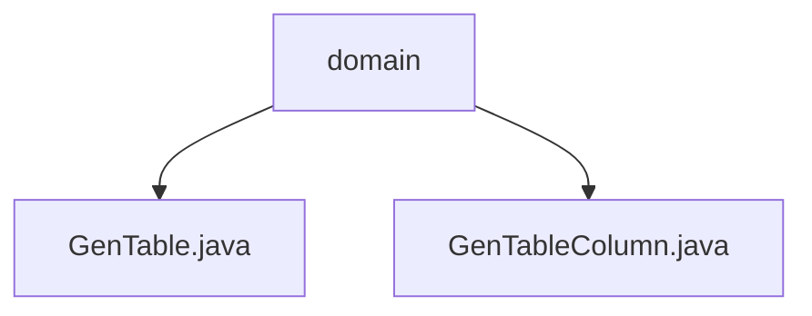

# 基础信息

|      |      |
|------|------|
| 编码语言 | .java |
| 代码路径 | ruoyi-generator/ruoyi-generator/src/main/java/com/ruoyi/generator/domain |
| 包名 | ruoyi-generator.ruoyi-generator.src.main.java.com.ruoyi.generator.domain |
| 概述说明 | GenTable类用于生成管理表结构，支持子表、树表及CRUD操作。GenTableColumn类管理表列信息，确保完整性。 |

# 说明

GenTable类用于生成和管理表结构，包含表名、描述、列信息和生成路径等关键属性，支持处理子表、树表及常见的CRUD操作，适用于复杂表结构的生成。GenTableColumn类负责管理表列信息，包含列ID、表ID、列名、数据类型和对应的Java字段等属性，支持检查主键状态、自增属性和必填状态，确保表列信息的完整性和准确性。

### 包内部结构视图

该流程图展示了`ruoyi-generator`项目中`domain`目录下的文件层级关系。`domain`作为根节点，包含了两个文件：`GenTable.java`和`GenTableColumn.java`。这两个文件分别表示生成器的表和表列的领域模型，用于代码生成功能的核心数据结构。

# 文件列表 File List

| 名称   | 类型  | 说明 |
|-------|------|-------------|
| [GenTableColumn.java](GenTableColumn.md) | file | GenTableColumn类管理表列信息，支持主键、自增、必填等状态检查。 |
| [GenTable.java](GenTable.md) | file | GenTable类生成表结构，含表名、描述、列信息、路径，支持子表、树表、CRUD操作。 |
| [GenTableColumn.java](GenTableColumn.md) | file | GenTableColumn类管理表列信息，支持主键、自增、必填等状态检查。 |
| [GenTable.java](GenTable.md) | file | GenTable类生成表结构，含表名、描述、列信息、路径，支持子表、树表、CRUD操作。 |

