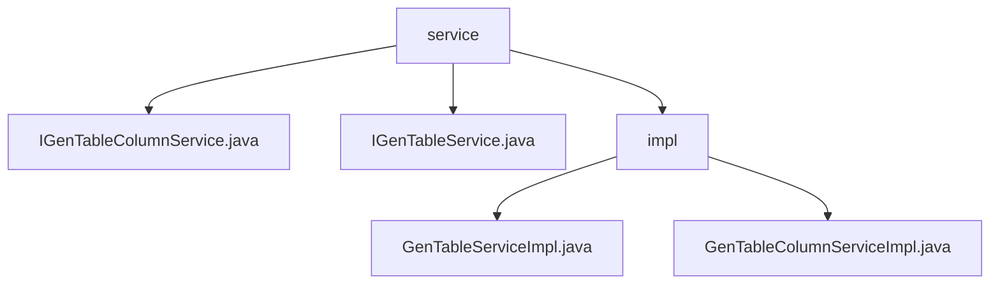

# 基础信息

|      |      |
|------|------|
| 编码语言 | .java |
| 代码路径 | ruoyi-generator/ruoyi-generator/src/main/java/com/ruoyi/generator/service |
| 包名 | ruoyi-generator.ruoyi-generator.src.main.java.com.ruoyi.generator.service |
| 概述说明 | GenTableServiceImpl实现IGenTableService，支持数据查询、修改、删除及代码生成，提升开发效率和系统可维护性。 |

# 说明

GenTableServiceImpl实现了IGenTableService接口，提供了全面的业务功能支持，包括业务数据的查询、修改和删除操作，并具备生成代码的能力，显著提升了开发效率和系统可维护性。该模块还实现了对业务字段的完整生命周期管理，支持查询、新增、修改和删除业务字段，确保用户能够高效维护和更新业务数据，增强了系统操作性和数据管理的便捷性。

### 包内部结构视图

该流程图展示了`ruoyi-generator`项目中`service`目录的层级结构。`service`目录下包含两个接口文件`IGenTableColumnService.java`和`IGenTableService.java`，以及一个`impl`子目录。`impl`子目录中包含两个实现类文件`GenTableServiceImpl.java`和`GenTableColumnServiceImpl.java`。

# 文件列表 File List

| 名称   | 类型  | 说明 |
|-------|------|-------------|
| [IGenTableColumnService.java](IGenTableColumnService.md) | file | 内容为空，无法生成概要描述。 |
| [IGenTableService.java](IGenTableService.md) | file | 输入内容为空，无法生成概要描述。 |
| [impl](impl/_module.md) | package | GenTableServiceImpl实现业务数据管理和代码生成，支持增删改查操作，提升开发效率和系统维护性。 |
| [IGenTableColumnService.java](IGenTableColumnService.md) | file | 内容为空，无法生成概要描述。 |
| [IGenTableService.java](IGenTableService.md) | file | 输入内容为空，无法生成概要描述。 |
| [impl](impl/_module.md) | package | GenTableServiceImpl实现业务数据管理和代码生成，支持增删改查操作，提升开发效率和系统维护性。 |

