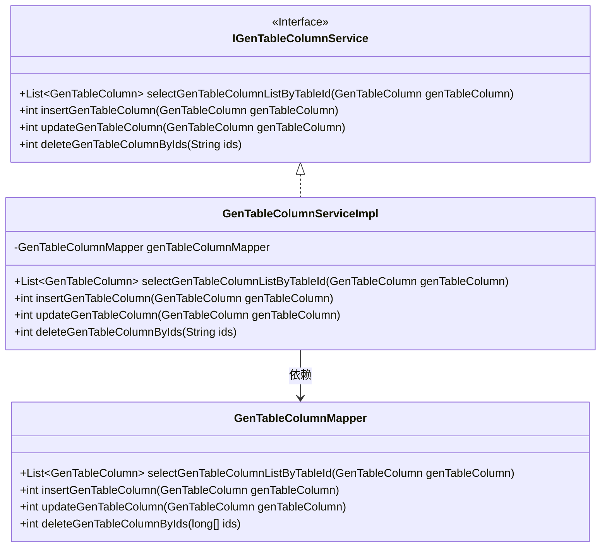
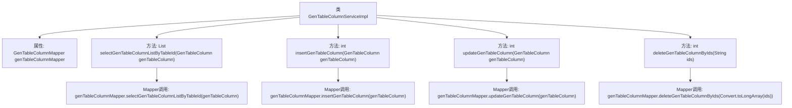

# 基础信息

|      |      |
|------|------|
| 编码语言 | .java |
| 代码路径 | ruoyi-generator/ruoyi-generator/src/main/java/com/ruoyi/generator/service/impl/GenTableColumnServiceImpl.java |
| 包名 | com.ruoyi.generator.service.impl |
| 依赖项 | ['java.util.List', 'org.springframework.beans.factory.annotation.Autowired', 'org.springframework.stereotype.Service', 'com.ruoyi.common.core.text.Convert', 'com.ruoyi.generator.domain.GenTableColumn', 'com.ruoyi.generator.mapper.GenTableColumnMapper', 'com.ruoyi.generator.service.IGenTableColumnService'] |
| 概述说明 | 实现业务字段的增删改查功能。 |

# 说明

该内容描述了一个软件功能模块，主要实现了对业务字段的基本操作。具体功能包括查询业务字段信息、新增业务字段、修改现有业务字段以及删除不再需要的业务字段。这些操作涵盖了业务字段的完整生命周期管理，确保用户能够高效地维护和更新业务数据。通过该模块，用户可以灵活地处理业务字段的增删改查需求，从而提升系统的可操作性和数据管理的便捷性。

# 类列表 Class Summary

| 名称   | 类型  | 说明 |
|-------|------|-------------|
| GenTableColumnServiceImpl | class | 实现业务字段的查询、新增、修改和删除功能。 |

## 类 GenTableColumnServiceImpl

|      |      |
|------|------|
| 访问范围 | @Service;public |
| 类型 | class |
| 名称 | GenTableColumnServiceImpl |
| 说明 | 实现业务字段的查询、新增、修改和删除功能。 |

### UML类图

这段代码描述了一个服务类 `GenTableColumnServiceImpl`，它实现了 `IGenTableColumnService` 接口，并依赖于 `GenTableColumnMapper` 来执行数据库操作。`IGenTableColumnService` 接口定义了四个方法，分别用于查询、新增、修改和删除业务字段。`GenTableColumnServiceImpl` 类通过调用 `GenTableColumnMapper` 的方法来实现这些操作。整个设计遵循了依赖注入的原则，使得服务类与数据访问层解耦，便于维护和测试。

### 内部方法调用关系图

该流程图描述了`GenTableColumnServiceImpl`类的结构及其与`GenTableColumnMapper`的交互关系。类中包含了四个主要方法，分别用于查询、新增、修改和删除业务字段。每个方法都调用了`GenTableColumnMapper`中的相应方法来完成数据库操作。通过该流程图，可以清晰地看到每个方法的执行路径及其与Mapper的调用关系。

### 字段列表 Field List

| 名称  | 类型  | 说明 |
|-------|-------|------|
| genTableColumnMapper | GenTableColumnMapper | 自动注入GenTableColumnMapper实例。 |

### 方法列表 Method List

| 名称  | 类型  | 说明 |
|-------|-------|------|
| selectGenTableColumnListByTableId | List<GenTableColumn> | 根据表ID查询生成表列信息列表。 |
| insertGenTableColumn | int | 重写插入生成表列方法，调用映射器插入操作。 |
| updateGenTableColumn | int | 更新GenTableColumn表列信息的方法。 |
| deleteGenTableColumnByIds | int | 删除指定ID的GenTable列数据。 |

