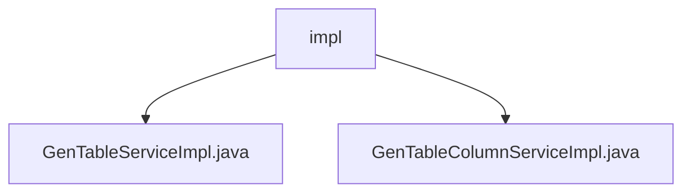

# 基础信息

|      |      |
|------|------|
| 编码语言 | .java |
| 代码路径 | ruoyi-generator/ruoyi-generator/src/main/java/com/ruoyi/generator/service/impl |
| 包名 | ruoyi-generator.ruoyi-generator.src.main.java.com.ruoyi.generator.service.impl |
| 概述说明 | GenTableServiceImpl实现业务数据管理和代码生成，支持增删改查操作，提升开发效率和系统维护性。 |

# 说明

GenTableServiceImpl实现了IGenTableService接口，提供全面的业务功能支持，包括业务数据的查询、修改和删除操作，并具备生成代码的能力，提升开发效率和系统可维护性。同时，该模块实现了对业务字段的完整生命周期管理，支持查询、新增、修改和删除业务字段，确保用户能高效维护和更新业务数据，提升系统操作性和数据管理便捷性。

### 包内部结构视图

该流程图展示了`ruoyi-generator`项目中`impl`文件夹的层级关系。`impl`文件夹下包含两个实现类文件：`GenTableServiceImpl.java`和`GenTableColumnServiceImpl.java`。这些文件是`ruoyi-generator`模块的核心服务实现部分，分别用于处理生成表和表列的逻辑。

# 文件列表 File List

| 名称   | 类型  | 说明 |
|-------|------|-------------|
| [GenTableColumnServiceImpl.java](GenTableColumnServiceImpl.md) | file | 实现业务字段的增删改查功能。 |
| [GenTableServiceImpl.java](GenTableServiceImpl.md) | file | GenTableServiceImpl实现IGenTableService，提供业务查询、修改、删除及生成代码功能。 |
| [GenTableColumnServiceImpl.java](GenTableColumnServiceImpl.md) | file | 实现业务字段的增删改查功能。 |
| [GenTableServiceImpl.java](GenTableServiceImpl.md) | file | GenTableServiceImpl实现IGenTableService，提供业务查询、修改、删除及生成代码功能。 |

