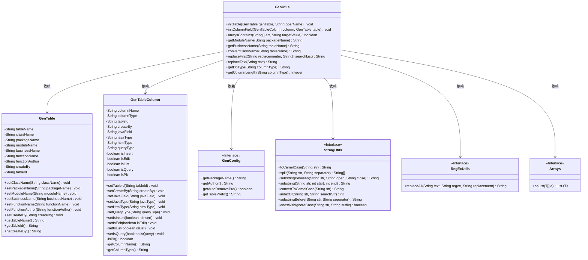
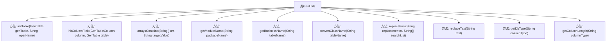

# 基础信息

|      |      |
|------|------|
| 编码语言 | .java |
| 代码路径 | ruoyi-generator/ruoyi-generator/src/main/java/com/ruoyi/generator/util/GenUtils.java |
| 包名 | com.ruoyi.generator.util |
| 依赖项 | ['java.util.Arrays', 'org.apache.commons.lang3.RegExUtils', 'com.ruoyi.common.constant.GenConstants', 'com.ruoyi.common.utils.StringUtils', 'com.ruoyi.generator.config.GenConfig', 'com.ruoyi.generator.domain.GenTable', 'com.ruoyi.generator.domain.GenTableColumn'] |
| 概述说明 | GenUtils类负责表和列属性初始化，涵盖表名转换、包名设置及字段类型处理。 |

# 说明

GenUtils类主要用于初始化表和列的属性，具备多种功能。它能够将表名转换为特定格式，设置包名，处理字段类型等。这些功能帮助开发者在生成代码或进行数据库操作时，自动化和标准化表和列的定义，提高开发效率和代码一致性。

# 类列表 Class Summary

| 名称   | 类型  | 说明 |
|-------|------|-------------|
| GenUtils | class | GenUtils类用于初始化表和列属性，包含表名转换、包名设置、字段类型处理等功能。 |

## 类 GenUtils

|      |      |
|------|------|
| 访问范围 | public |
| 类型 | class |
| 名称 | GenUtils |
| 说明 | GenUtils类用于初始化表和列属性，包含表名转换、包名设置、字段类型处理等功能。 |

### UML类图

### 描述
该代码定义了一个名为 `GenUtils` 的工具类，主要用于生成和初始化数据库表及其列的相关信息。`GenUtils` 类依赖于 `GenTable` 和 `GenTableColumn` 类来存储表信息和列属性，同时通过 `GenConfig`、`StringUtils`、`RegExUtils` 和 `Arrays` 等工具类来辅助完成数据处理和转换。`GenUtils` 提供了多个静态方法，如 `initTable` 用于初始化表信息，`initColumnField` 用于初始化列属性，以及其他辅助方法如 `arraysContains` 和 `getModuleName` 等。

### 内部方法调用关系图

这段代码定义了一个名为 `GenUtils` 的工具类，主要用于生成代码时初始化表信息和列属性字段。`initTable` 方法用于设置表的类名、包名、模块名、业务名、功能名和作者等信息。`initColumnField` 方法用于根据列的类型和名称设置 Java 字段名、类型、查询类型、HTML 类型等属性。其他方法如 `arraysContains`、`getModuleName`、`getBusinessName` 等则是辅助方法，用于处理字符串、数组和类型转换等操作。

### 字段列表 Field List

| 名称  | 类型  | 说明 |
|-------|-------|------|

### 方法列表 Method List

| 名称  | 类型  | 说明 |
|-------|-------|------|
| getDbType | String | 该方法提取数据库列类型，忽略括号内内容。 |
| replaceFirst | String | 该方法替换字符串中首个匹配项并返回结果。 |
| getModuleName | String | 该方法从包名中提取模块名，返回最后一个点后的子字符串。 |
| convertClassName | String | 方法根据配置移除表名前缀并转换为驼峰命名。 |
| arraysContains | boolean | 该方法检查字符串数组是否包含目标值，返回布尔结果。 |
| getBusinessName | String | 方法提取表名中最后一个下划线后的部分作为业务名称。 |
| initTable | void | 初始化生成表，设置类名、包名、模块名、业务名、功能名、作者和创建者。 |
| getColumnLength | Integer | 提取列类型长度，若包含括号则返回括号内数值，否则返回0。 |
| initColumnField | void | 初始化表字段，设置Java字段名、类型、查询类型及HTML控件类型，处理插入、编辑、列表、查询字段逻辑。 |
| replaceText | String | 静态方法替换文本中“表”或“若依”为空字符串。 |

