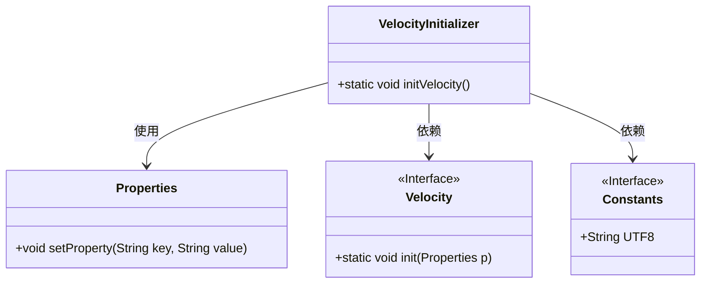
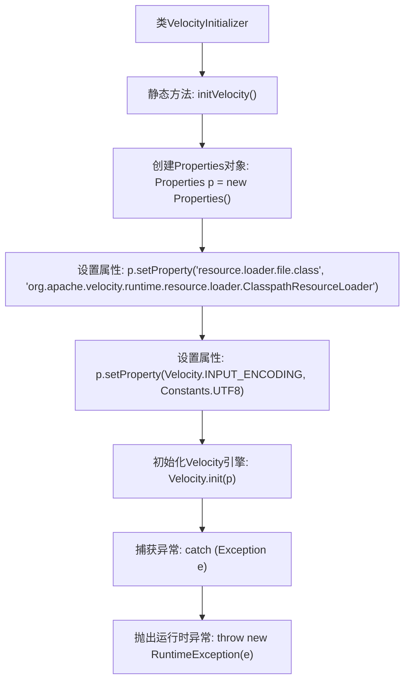

# 基础信息

|      |      |
|------|------|
| 编码语言 | .java |
| 代码路径 | ruoyi-generator/ruoyi-generator/src/main/java/com/ruoyi/generator/util/VelocityInitializer.java |
| 包名 | com.ruoyi.generator.util |
| 依赖项 | ['java.util.Properties', 'org.apache.velocity.app.Velocity', 'com.ruoyi.common.constant.Constants'] |
| 概述说明 | VelocityInitializer类负责初始化Velocity引擎，配置资源加载器和字符集。 |

# 说明

VelocityInitializer类的主要功能是初始化Velocity引擎，负责配置资源加载器和字符集。通过该类的操作，可以确保Velocity引擎在启动时具备正确的资源加载方式和字符集设置，从而为后续的模板处理和渲染提供基础支持。

# 类列表 Class Summary

| 名称   | 类型  | 说明 |
|-------|------|-------------|
| VelocityInitializer | class | VelocityInitializer类用于初始化Velocity引擎，配置资源加载器和字符集。 |

## 类 VelocityInitializer

|      |      |
|------|------|
| 访问范围 | public |
| 类型 | class |
| 名称 | VelocityInitializer |
| 说明 | VelocityInitializer类用于初始化Velocity引擎，配置资源加载器和字符集。 |

### UML类图

类图描述：`VelocityInitializer` 类包含一个静态方法 `initVelocity`，用于初始化 Velocity 引擎。该方法使用 `Properties` 类来设置配置属性，并依赖于 `Velocity` 接口来初始化引擎，同时使用 `Constants` 接口中的常量来定义字符集。整个流程通过捕获异常来处理可能的错误情况。

### 内部方法调用关系图

这段代码定义了一个名为 `VelocityInitializer` 的类，其中包含一个静态方法 `initVelocity()`，用于初始化Velocity引擎。方法首先创建了一个 `Properties` 对象，并设置了两个关键属性：资源加载器的类和输入字符集。然后，它使用这些配置初始化Velocity引擎。如果在初始化过程中发生任何异常，方法会捕获并抛出一个运行时异常。流程图清晰地展示了方法的执行流程和异常处理路径。

### 字段列表 Field List

| 名称  | 类型  | 说明 |
|-------|-------|------|

### 方法列表 Method List

| 名称  | 类型  | 说明 |
|-------|-------|------|
| initVelocity | void | 初始化Velocity引擎，配置资源加载器和字符集。 |

