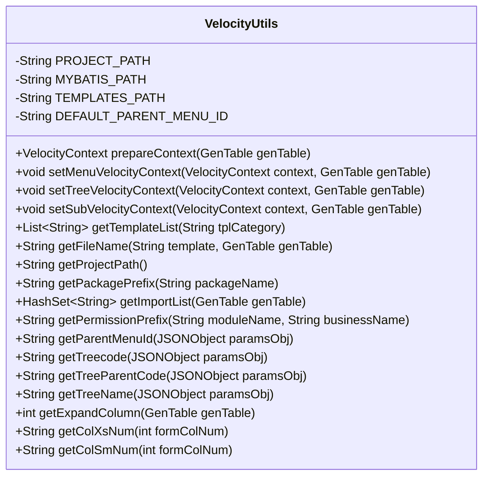

# 基础信息

|      |      |
|------|------|
| 编码语言 | .java |
| 代码路径 | ruoyi-generator/ruoyi-generator/src/main/java/com/ruoyi/generator/util/VelocityUtils.java |
| 包名 | com.ruoyi.generator.util |
| 依赖项 | ['java.util.ArrayList', 'java.util.HashSet', 'java.util.List', 'org.apache.velocity.VelocityContext', 'com.alibaba.fastjson.JSONObject', 'com.ruoyi.common.constant.GenConstants', 'com.ruoyi.common.utils.DateUtils', 'com.ruoyi.common.utils.StringUtils', 'com.ruoyi.generator.config.GenConfig', 'com.ruoyi.generator.domain.GenTable', 'com.ruoyi.generator.domain.GenTableColumn'] |
| 概述说明 | VelocityUtils类生成模板上下文，包含路径、菜单、树结构配置。 |

# 说明

VelocityUtils类是一个用于生成模板上下文的工具类，主要功能包括处理路径、菜单和树结构等配置。通过该类，用户可以方便地获取和管理模板所需的上下文信息，确保模板能够正确渲染和展示相关内容。该类设计旨在简化模板上下文的生成过程，提升开发效率和代码可维护性。

# 类列表 Class Summary

| 名称   | 类型  | 说明 |
|-------|------|-------------|
| VelocityUtils | class | VelocityUtils类用于生成模板上下文，包含路径、菜单、树结构等配置。 |

## 类 VelocityUtils

|      |      |
|------|------|
| 访问范围 | public |
| 类型 | class |
| 名称 | VelocityUtils |
| 说明 | VelocityUtils类用于生成模板上下文，包含路径、菜单、树结构等配置。 |

### UML类图

### 描述
`VelocityUtils` 类是一个工具类，主要用于处理与 Velocity 模板相关的操作。它包含了多个静态方法，用于准备模板上下文、设置菜单、树形结构和子表的上下文信息，以及获取模板列表、文件名、项目路径、包前缀、导入包列表等。这些方法通过处理 `GenTable` 对象，生成相应的模板数据，支持不同的模板类型（如 CRUD、树形结构、子表等）。该类还提供了一些辅助方法，用于获取权限前缀、父菜单 ID、树编码等信息。

### 内部方法调用关系图

```mermaid
graph TD
    A["类VelocityUtils"]
    B["常量: PROJECT_PATH"]
    C["常量: MYBATIS_PATH"]
    D["常量: TEMPLATES_PATH"]
    E["常量: DEFAULT_PARENT_MENU_ID"]
    F["方法: prepareContext(GenTable genTable)"]
    G["方法: setMenuVelocityContext(VelocityContext context, GenTable genTable)"]
    H["方法: setTreeVelocityContext(VelocityContext context, GenTable genTable)"]
    I["方法: setSubVelocityContext(VelocityContext context, GenTable genTable)"]
    J["方法: getTemplateList(String tplCategory)"]
    K["方法: getFileName(String template, GenTable genTable)"]
    L["方法: getProjectPath()"]
    M["方法: getPackagePrefix(String packageName)"]
    N["方法: getImportList(GenTable genTable)"]
    O["方法: getPermissionPrefix(String moduleName, String businessName)"]
    P["方法: getParentMenuId(JSONObject paramsObj)"]
    Q["方法: getTreecode(JSONObject paramsObj)"]
    R["方法: getTreeParentCode(JSONObject paramsObj)"]
    S["方法: getTreeName(JSONObject paramsObj)"]
    T["方法: getExpandColumn(GenTable genTable)"]
    U["方法: getColXsNum(int formColNum)"]
    V["方法: getColSmNum(int formColNum)"]

    A --> B
    A --> C
    A --> D
    A --> E
    A --> F
    A --> G
    A --> H
    A --> I
    A --> J
    A --> K
    A --> L
    A --> M
    A --> N
    A --> O
    A --> P
    A --> Q
    A --> R
    A --> S
    A --> T
    A --> U
    A --> V
```

这段代码定义了一个名为`VelocityUtils`的工具类，主要用于生成和配置Velocity模板的上下文信息。类中包含多个常量和方法，分别用于设置模板路径、生成模板列表、获取文件名、配置上下文变量等。通过流程图可以清晰地看到类中各个方法之间的调用关系，帮助理解代码的整体结构和功能。

### 字段列表 Field List

| 名称  | 类型  | 说明 |
|-------|-------|------|
| PROJECT_PATH = "main/java" | String | 项目路径定义为main/java。 |
| DEFAULT_PARENT_MENU_ID = "3" | String | 私有静态常量DEFAULT_PARENT_MENU_ID默认值为"3"。 |
| TEMPLATES_PATH = "main/resources/templates" | String | 定义常量TEMPLATES_PATH，路径为main/resources/templates。 |
| MYBATIS_PATH = "main/resources/mapper" | String | 定义MYBATIS_PATH常量，值为"main/resources/mapper"。 |

### 方法列表 Method List

| 名称  | 类型  | 说明 |
|-------|-------|------|
| getColXsNum | String | 根据输入数字返回对应的CSS类名。 |
| getPermissionPrefix | String | 静态方法生成权限前缀，格式为模块名加业务名。 |
| getPackagePrefix | String | 该方法提取包名前缀，返回最后一个点之前的部分。 |
| getProjectPath | String | 获取项目路径，拼接包名并替换为路径格式。 |
| getTreeParentCode | String | 获取树结构父节点编码，若存在则转为驼峰格式，否则返回空字符串。 |
| getFileName | String | 根据模板生成不同文件路径，包括Java、MyBatis和HTML文件。 |
| getParentMenuId | String | 方法getParentMenuId从paramsObj获取父菜单ID，若无则返回默认值。 |
| getExpandColumn | int | 获取表格展开列数，基于树名匹配列名。 |
| getColSmNum | String | 根据formColNum返回相应col-sm类名。 |
| getImportList | HashSet<String> | 获取GenTable的导入列表，包含日期、BigDecimal等类型所需的类。 |
| setMenuVelocityContext | void | 方法设置菜单速度上下文，解析选项并获取父菜单ID，存入上下文。 |
| setSubVelocityContext | void | 设置子表Velocity上下文，包含子表信息及类名转换。 |
| setTreeVelocityContext | void | 方法设置树结构相关参数到VelocityContext中，包括树编码、父编码、名称和扩展列。 |
| getTemplateList | List<String> | 根据模板类别获取模板列表，包含Java、XML、HTML和SQL文件路径。 |
| prepareContext | VelocityContext | 准备VelocityContext，包含模块、业务、包名、功能等关键信息，并根据模板类型设置上下文。 |
| getTreeName | String | 方法getTreeName从JSONObject中提取并转换树名为驼峰格式，若无则返回空字符串。 |
| getTreecode | String | 静态方法getTreecode从JSONObject中提取并返回驼峰格式的TREE_CODE值，若无则返回空字符串。 |

