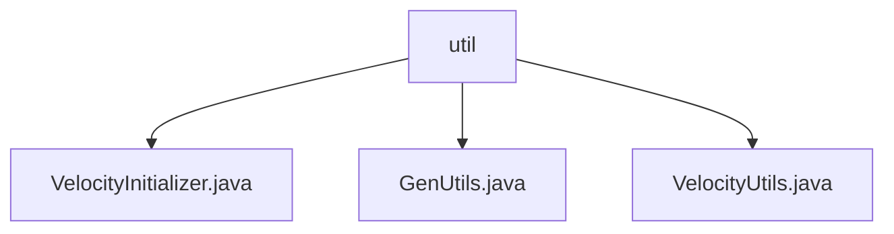

# 基础信息

|      |      |
|------|------|
| 编码语言 | .java |
| 代码路径 | ruoyi-generator/ruoyi-generator/src/main/java/com/ruoyi/generator/util |
| 包名 | ruoyi-generator.ruoyi-generator.src.main.java.com.ruoyi.generator.util |
| 概述说明 | VelocityInitializer初始化引擎，GenUtils处理表列属性，VelocityUtils生成模板上下文。 |

# 说明

VelocityInitializer类负责初始化Velocity引擎，配置资源加载器和字符集，确保引擎启动时具备正确的资源加载方式和字符集设置，为模板处理和渲染提供基础支持。GenUtils类用于初始化表和列的属性，将表名转换为特定格式，设置包名，处理字段类型，自动化和标准化表和列的定义，提高开发效率和代码一致性。VelocityUtils类是一个生成模板上下文的工具类，处理路径、菜单和树结构等配置，方便用户获取和管理模板所需的上下文信息，确保模板正确渲染，简化上下文生成过程，提升开发效率和代码可维护性。

### 包内部结构视图

该流程图展示了`ruoyi-generator`项目中`util`目录下的文件层级关系。`util`目录包含三个文件：`VelocityInitializer.java`、`GenUtils.java`和`VelocityUtils.java`。这些文件位于同一层级，直接归属于`util`目录，展示了它们在项目中的结构关系。

# 文件列表 File List

| 名称   | 类型  | 说明 |
|-------|------|-------------|
| [VelocityUtils.java](VelocityUtils.md) | file | VelocityUtils类生成模板上下文，包含路径、菜单、树结构配置。 |
| [GenUtils.java](GenUtils.md) | file | GenUtils类负责表和列属性初始化，涵盖表名转换、包名设置及字段类型处理。 |
| [VelocityInitializer.java](VelocityInitializer.md) | file | VelocityInitializer类负责初始化Velocity引擎，配置资源加载器和字符集。 |
| [VelocityUtils.java](VelocityUtils.md) | file | VelocityUtils类生成模板上下文，包含路径、菜单、树结构配置。 |
| [GenUtils.java](GenUtils.md) | file | GenUtils类负责表和列属性初始化，涵盖表名转换、包名设置及字段类型处理。 |
| [VelocityInitializer.java](VelocityInitializer.md) | file | VelocityInitializer类负责初始化Velocity引擎，配置资源加载器和字符集。 |

